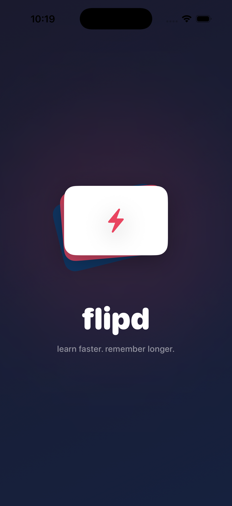
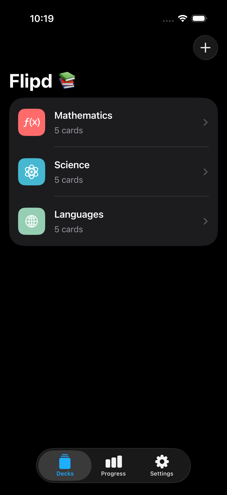
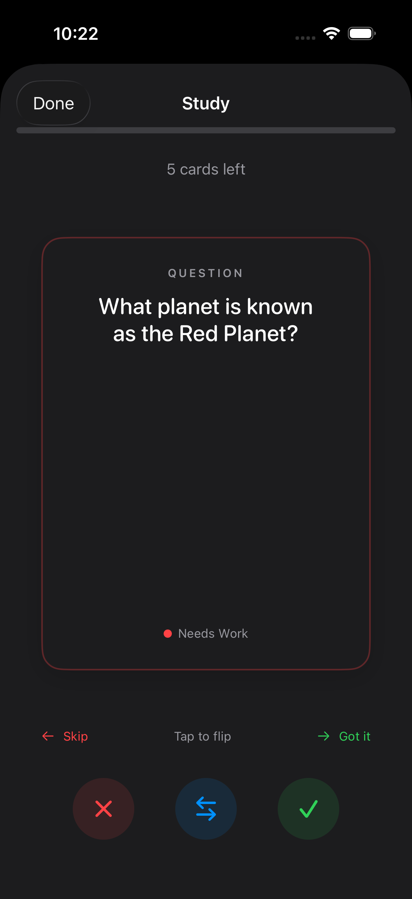
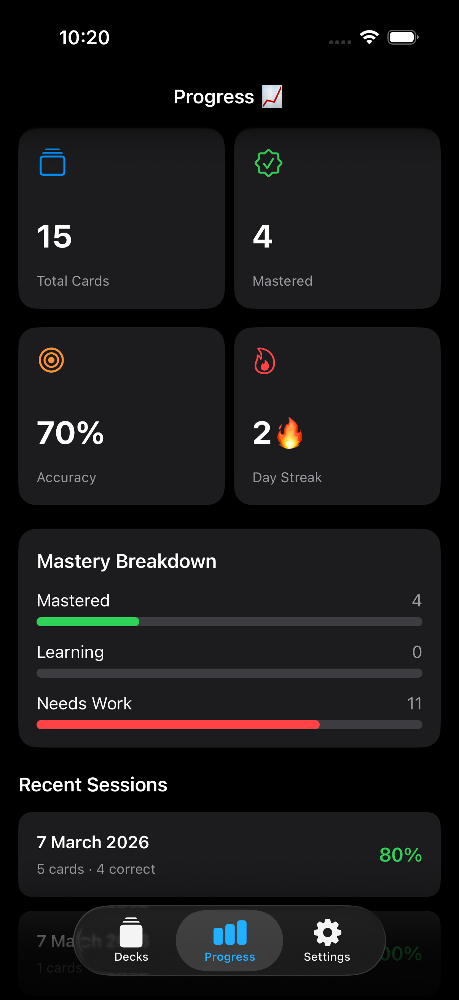
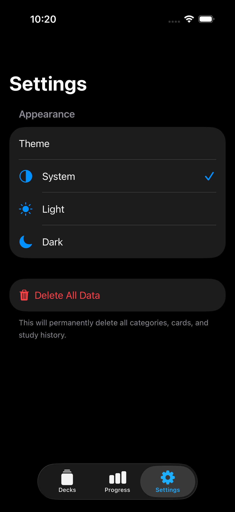

# ⚡ Flipd

> **Learn faster. Remember longer.**

Flipd is a beautiful, minimal flashcard app for iOS built with SwiftUI and MVVM architecture. Create custom decks, study with swipe & flip animations, and track your progress over time.

---

## 📱 Screenshots

| Launch | Decks | Study | Progress | Settings |
|-------|-------|-------|----------|----------|
|  |  |  |  |  |
---

## ✨ Features

- **Custom Flashcards** — Add, edit, and delete cards with question & answer fields
- **Categories / Decks** — Organise cards into colour-coded decks with custom icons
- **Swipe to Answer** — Swipe right ✅ for correct, left ❌ to skip
- **3D Flip Animation** — Tap any card to reveal the answer with a smooth flip
- **Progress Tracking** — Track accuracy, mastery level, and study streaks
- **Mastery Levels** — Cards are automatically rated as Mastered / Learning / Needs Work
- **Dark Mode** — Full dark, light, and system theme support
- **Launch Screen** — Animated splash screen on every app open
- **Delete All Data** — One-tap data reset from Settings

---

## 🏗 Architecture

Flipd follows the **MVVM** (Model-View-ViewModel) pattern throughout.

```
Flipd/
├── FlipdApp.swift                  # @main entry point + color scheme
│
├── Models/
│   ├── Flashcard.swift             # Card data + MasteryLevel enum
│   ├── Category.swift              # Category data + sample data
│   └── Progress.swift              # StudySession + ProgressStats
│
├── ViewModels/
│   ├── CardListViewModel.swift     # CRUD for cards & categories
│   ├── StudyViewModel.swift        # Flip + swipe + session logic
│   └── ProgressViewModel.swift     # Stats, streaks, session history
│
├── Views/
│   ├── LaunchView.swift            # Animated splash screen
│   ├── HomeView.swift              # TabView root + all sheets
│   ├── StudyView.swift             # Study session UI
│   ├── FlashcardView.swift         # 3D flip card component
│   └── StatsView.swift             # Progress dashboard
│
└── Services/
    └── StorageService.swift        # UserDefaults persistence (protocol-based)
```

### Layer Responsibilities

| Layer | Responsibility |
|-------|---------------|
| **Model** | Plain `Codable` structs — no UI, no logic |
| **ViewModel** | `@MainActor ObservableObject` — state, intents, persistence |
| **View** | SwiftUI `View` — reads `@Published` state, calls VM intents |
| **Service** | Protocol-based storage — injectable and testable |

---

## 🚀 Getting Started

### Requirements

- Xcode 15+
- iOS 17+
- Swift 5.9+

### Installation

1. Clone or download the project
2. Open Xcode and create a new **iOS App** project named `Flipd`
3. Copy all `.swift` files into their respective folders
4. Make sure all files are added to the **Flipd target** (File Inspector → Target Membership ✅)
5. Build and run on simulator or device (`Cmd + R`)

> ⚠️ No external dependencies — pure SwiftUI, no SPM packages needed.

---

## 🎮 How to Use

1. **Create a Deck** — Tap `+` on the Decks tab, choose a name, colour, and icon
2. **Add Cards** — Tap your deck → tap `+` to add question & answer pairs
3. **Study** — Tap the ▶ play button, swipe right if you know it, left if you don't
4. **Flip** — Tap any card or use the flip button to reveal the answer
5. **Track Progress** — Visit the Progress tab to see accuracy and streaks
6. **Switch Theme** — Go to Settings → Appearance to switch Dark / Light / System

---

## 🧠 Key Design Decisions

- **`@StateObject` vs `@ObservedObject`** — Views that *own* a VM use `@StateObject`; child views that receive one use `@ObservedObject`
- **`StorageServiceProtocol`** — Enables mock injection for unit tests without touching `UserDefaults`
- **`@MainActor` on ViewModels** — Guarantees all `@Published` mutations happen on the main thread
- **`Task { @MainActor in }` over `DispatchQueue`** — Keeps async work properly isolated to the main actor
- **Swipe logic in ViewModel** — `endDrag(_:screenWidth:)` handles threshold detection so Views stay declarative
- **`nonisolated(unsafe)` on `StorageService.shared`** — Allows the singleton to be accessed from non-isolated contexts safely

---

## 🗺 Roadmap

- [ ] Spaced repetition algorithm
- [ ] Daily study reminders (notifications)
- [ ] iCloud sync across devices
- [ ] Import cards from CSV
- [ ] Quiz mode (multiple choice)
- [ ] Home screen widget
- [ ] Export deck as PDF
- [ ] Onboarding walkthrough
- [ ] Streak rewards & badges

---

## 📁 Data Storage

All data is stored locally using `UserDefaults` with `Codable` JSON encoding. No network requests, no accounts, no tracking.

| Key | Contents |
|-----|----------|
| `flipd.cards` | All flashcards |
| `flipd.categories` | All decks |
| `flipd.sessions` | Study session history |

---

## 🤝 Contributing

1. Fork the repo
2. Create a feature branch (`git checkout -b feature/spaced-repetition`)
3. Commit your changes (`git commit -m 'Add spaced repetition'`)
4. Push and open a Pull Request

---

## 📄 License

MIT License — free to use, modify, and distribute.

---

<p align="center">Made with ❤️ and SwiftUI</p>
